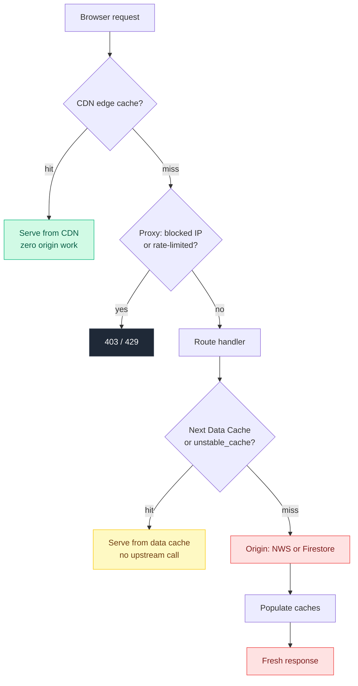
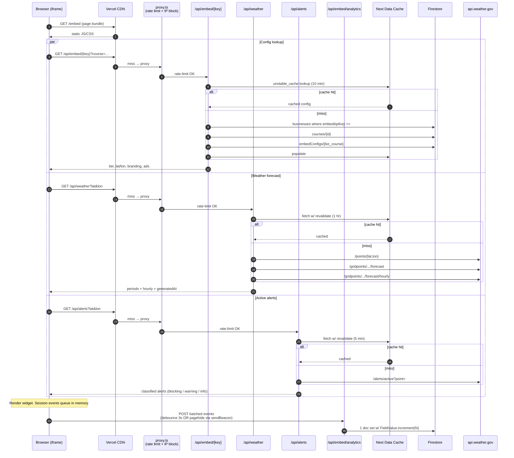
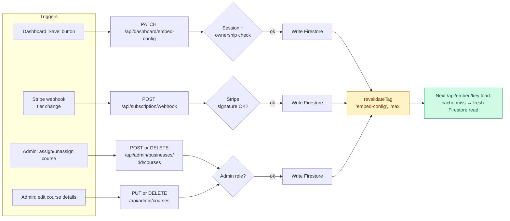

# TeeWeathr — Data Flow & Caching Reference

Visual reference for how data moves through the embed widget, where each
cache layer lives, and how mutations invalidate them. Companion to
`INFRASTRUCTURE.md` (which explains the *why* behind these choices).

---

## The big picture: layered request lifecycle

Every public request runs the same gauntlet. Each layer is cheaper than the
one below it; the goal is to die at the highest layer that can answer.

**Reading this:** green = no infra cost, yellow = function invocation but no
external call, red = origin work (NWS or Firestore). The cache layers
together push the vast majority of traffic into green.

---

## Keyed embed: full request flow

What happens when a paid customer's `<iframe src=".../embed?key=tw_…">`
loads. Three parallel data fetches, each with its own cache strategy.

**Key points:**
- Steps 2/8/14 are CDN cache hits in steady state — the common case skips
  every layer below the CDN.
- The three fetches happen in parallel, not in series. Total wall time =
  the slowest of the three (usually weather), not their sum.
- Step 23 onward: a single batched analytics POST with all events from the
  session, not one POST per click.

---

## Cache TTL reference

| Layer | What it caches | TTL | Where it lives |
|---|---|---|---|
| **CDN edge** (`Cache-Control: s-maxage`) | `/api/weather` response | 1 hr fresh, 24 hr SWR | Vercel global CDN |
| **CDN edge** | `/api/alerts` response | 5 min fresh, 5 min SWR | Vercel global CDN |
| **CDN edge** | `/api/embed/[key]` response (success) | 10 min fresh, 1 hr SWR | Vercel global CDN |
| **CDN edge** | `/api/embed/[key]` response (4xx) | 60 s | Vercel global CDN |
| **Next Data Cache** (`fetch.next.revalidate`) | NWS `/points` lookup | 24 hr | Vercel runtime cache |
| **Next Data Cache** | NWS forecast / hourly | 1 hr | Vercel runtime cache |
| **Next Data Cache** | NWS active alerts | 5 min | Vercel runtime cache |
| **`unstable_cache`** | Firestore embed-config result | 10 min | Vercel runtime cache |
| **Upstash Redis** | Rate-limit counters | 1 min sliding window | Upstash (external) |
| **Browser memory** | Analytics event queue | until flush (3 s / pagehide) | iframe JS |

---

## Mutation → invalidation flow

When a customer changes branding, gets a tier upgrade, or admin reassigns a
course, the cached embed config must update — without waiting for the 10-min
TTL.

**Reading this:** every server-side mutation that touches business config,
course details, or subscription tier ends with a single
`revalidateTag(EMBED_CONFIG_TAG, "max")` call. That bust propagates within
seconds — customers don't wait 10 minutes to see their save.

---

## What does NOT get cached (and why)

- **Analytics writes** (`POST /api/embed/analytics`). Mutations bypass
  edge caches by design; they go straight to Firestore (one batched write
  per session).
- **Auth-gated routes** (`/admin`, `/dashboard`, `/api/dashboard/*`). The
  proxy redirects unauthenticated requests to `/login`, and the page-level
  layouts read fresh session data per request. Caching personalized HTML
  would leak between users.
- **Stripe webhooks**. Single-shot mutations that mutate state and trigger
  a `revalidateTag`. Idempotent on the Stripe side via signature
  verification.
- **NWS active alerts beyond the 5-minute window**. Tornado warnings need
  to propagate fast — caching them aggressively would defeat the purpose.

---

## Onboarding new devs: where to start

1. Read this file to get the cache topology.
2. Open `INFRASTRUCTURE.md` for the *why* — design tradeoffs, what we
   considered and rejected.
3. To add a new cached endpoint, copy the shape of
   `src/app/api/weather/route.ts`: `next.revalidate` on the upstream
   `fetch`, `Cache-Control` on the response, optional `unstable_cache`
   wrapper for non-fetch sources.
4. To invalidate caches on mutation, import `revalidateTag` from
   `next/cache` and the relevant tag constant. Always pass the second
   `swr` argument (`"max"` is the safe default in Next 16).
